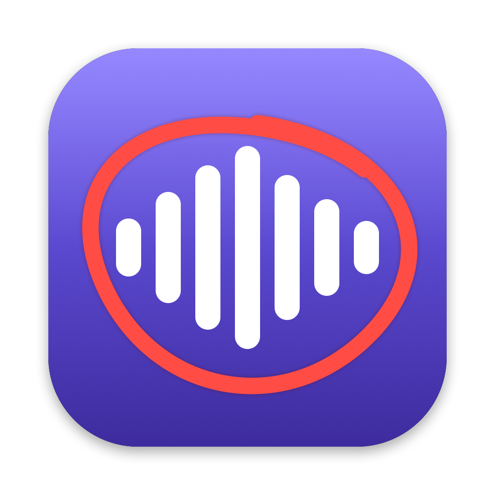

# Remote



A menu bar app for macOS. Press a hotkey, point at something on screen, ask
out loud, and hear Claude's answer.

1. **⌥⇧A** freezes every display under an overlay and starts listening.
2. Talk. Optionally scribble on the screen to point at something: a loose
   circle, underline or arrow is enough. Right-click or Delete clears it.
3. **Return** (or ⌥⇧A again) asks. **Esc** cancels.
4. The answer is spoken with the system voice, so set a Siri voice in
   System Settings › Accessibility › Spoken Content to hear it in Siri's voice.

Claude gets a screenshot of each display (with your marks and a ring where the
pointer was), a close-up of the marked area, your transcript, and the name of
the app in front.

## Pieces

- **Speech to text**: Apple's on-device recognizer (`SFSpeechRecognizer` with
  `requiresOnDeviceRecognition`). Audio never leaves the Mac, and no
  dictation app is needed.
- **Claude**: your local Claude Code login (`claude -p`, model `claude-opus-5`),
  so answers count against your Claude subscription, not API credits. Any
  `ANTHROPIC_API_KEY` in the environment is stripped before `claude` runs.
- **Voice**: `/usr/bin/say` with the system voice.
- **Threads**: each thread is a Claude Code session. ⌥⇧A within 15 minutes of
  your last question continues the same thread, so follow-ups keep their
  context (Tab in the overlay switches between continuing and a new thread).
  The answer card shows the thread, with **Follow up** and **Open in
  Terminal**, which runs `claude --resume <id>` in cmux (or Terminal) so you
  can keep going by typing. The newest 3 threads are kept, in
  `~/Library/Application Support/Remote/` (`threads.json`, plus
  `history/<timestamp>/` with each request's images and answer).
- **Log**: `~/Library/Logs/Remote.log`.
- **Icon**: generated by `swift tools/make-icon.swift Resources/AppIcon.icns`.

## Build

```bash
./build.sh              # builds, installs to /Applications, launches
./build.sh --no-install
```

Only the Xcode command line tools are needed; there's no Xcode project.

Permissions on first run: Screen Recording, Microphone, Speech Recognition.
macOS ties these permissions to the app's code signature. Run
`tools/make-signing-cert.sh` once: it creates a local self-signed "Remote
Local Signing" certificate in your login keychain, and `build.sh` signs with
it, so permissions survive rebuilds. Without it, `build.sh` signs ad-hoc and
every rebuild resets them. (Use another identity with `SIGN_IDENTITY=…`.)

## Settings

Open Remote again from Finder or Spotlight, or pick **Settings…** from
the menu bar. That shows each permission with an Allow button, whether Claude
Code is logged in, a voice test, and Open at login.

## Prerequisites

- macOS 14 or later.
- [Claude Code](https://claude.com/claude-code) installed and logged in with a
  Claude subscription (`claude auth status` shows `"loggedIn": true`).
- Screen Recording, Microphone and Speech Recognition allowed for Remote.

## Tests

```bash
"build/Remote.app/Contents/MacOS/Remote" --selftest "What's in the red circle?"
open -n "/Applications/Remote.app" --args --transcribe-file /path/to/audio.aiff   # writes audio.aiff.txt
```

## Install without building

Download `Read-Aloud.zip` from the latest release, unzip, and move
`Remote.app` to Applications. It isn't notarized, so the first time,
right-click it and choose **Open**.

## License

MIT
